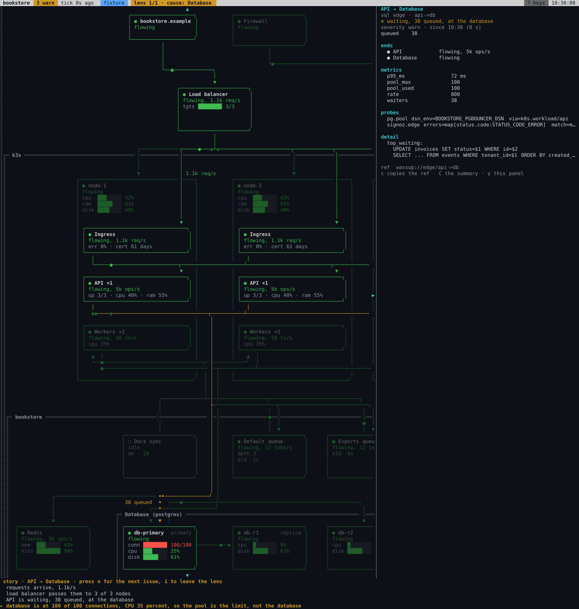

<div align="center">

# wassup

**One live architecture diagram of your Kubernetes system, in the terminal.**

Where is it stuck, since when, what changed.

[](https://github.com/danilopopovikj/wassup/actions/workflows/ci.yml)
[](https://pkg.go.dev/github.com/danilopopovikj/wassup)
[](https://scorecard.dev/viewer/?uri=github.com/danilopopovikj/wassup)
[](LICENSE)

[Try it](#try-it) •
[Install](#install) •
[Set up your system](#set-up-your-system) •
[Docs](#docs)



</div>

wassup draws your system once and keeps the picture live. When something
breaks, it lights the path from the symptom to the cause and says what is
happening in plain words:

```
story · API → Database
  requests arrive, 1.1k/s
  load balancer passes them to 3 of 3 nodes
  API is waiting, 38 queued, at the database
▸ database is at 100 of 100 connections, CPU 35 percent, so the pool is the limit, not the database
```

It is a single binary that runs in tmux and only reads. There is no daemon
and nothing to install in the cluster.

**Can it harm production?** No, and not because of how it is used: the
clients wassup is built on refuse everything but reads before it is sent. A
request to Kubernetes or to an HTTP API that is not a GET or a HEAD, a
Postgres statement that is not a `SELECT` or a `SHOW`, a Redis command that
is not `INFO`, `LLEN` or `LINDEX`: none of them leaves the process, and
tests prove it. The one exception is the request that opens a port-forward,
which changes nothing in the cluster. `wassup access` prints a read-only
account with a token that expires, so you do not need an admin kubeconfig
either. [More](docs/setup.md#access-and-credentials).

> [!NOTE]
> wassup is early and before 1.0. It works, but the file formats in
> `.wassup/` may still change between minor versions.

## Try it

You don't need a cluster. The demo replays a recorded incident:

```sh
go install github.com/danilopopovikj/wassup/cmd/wassup@latest

wassup demo              # a connection pool runs out
wassup demo 4 --speed 5  # a node runs out of memory, five times faster
wassup demo --list       # all twelve scenarios
```

Press `i` for the issue lens, `enter` for the detail panel and `?` for every
key.

## Install

With Go 1.26 or newer:

```sh
go install github.com/danilopopovikj/wassup/cmd/wassup@latest
"$(go env GOPATH)/bin/wassup" version
```

Without Go, the install script takes the release for your machine, checks
it against `checksums.txt` and puts the binary in `~/.local/bin`:

```sh
curl -fsSL https://raw.githubusercontent.com/danilopopovikj/wassup/main/install.sh | sh
```

Both end with `wassup version`, which tells you when the directory of the
binary is not on your `PATH` and prints the line to add to your shell
profile. If `wassup` is "not found" after installing, that is the reason.

To build from source instead:

```sh
git clone https://github.com/danilopopovikj/wassup
cd wassup
make install
```

## Set up your system

```sh
cd your-repo
wassup
```

The first run prints a setup prompt and copies it to your clipboard. Paste it
into [Claude Code](https://claude.com/claude-code). It asks you which
environment and which cluster, and how far it may reach. Then it reads your
Terraform, manifests, Helm values, network policies, code and the live
cluster, drafts the diagram with every connection cited to a file and line,
and shows you the picture before it attaches live data, one tier at a time:
first what needs only your kubeconfig, then what needs a token, then the
databases. Then run `wassup` again.

What belongs to your machine, the cluster to read and the credentials, goes
into `.wassup/local.env`, which git ignores. You export nothing, and a
Postgres inside the cluster needs no `kubectl port-forward`: wassup opens
its own.

wassup itself needs no AI to run, and you can do every step by hand.
[docs/setup.md](docs/setup.md) has both ways, and [examples/](examples) has
two complete configurations.

## Reading the diagram

Every box and every edge is always in exactly one of six states, with one
glyph and one color each.

| | State | Means |
| --- | --- | --- |
| `●` | flowing | work is moving |
| `○` | idle | healthy, nothing happening, and since when: "idle, called 3 h ago" |
| `≡` | waiting | work is queued at the destination |
| `◐` | processing | a long unit of work is running |
| `⊘` | blocked | traffic cannot pass |
| `✕` | failing | errors or crashes |

A box wassup has no data for is drawn as unbound, never as healthy. A box
that is up while nothing counts its traffic reads `◌ no rate measured`: not
idle, not broken, just not counted, and `wassup measure` says what would
count it.

| Key | Does |
| --- | --- |
| `i` | issue lens: only the path from the symptom to the cause |
| `n` | next issue |
| `enter` | detail panel for the selected box or edge |
| `t` | scrub the timeline to see when it started and what changed |
| `d` | detail level |
| `?` | every key |

You can drag and resize boxes with the mouse. The layout is yours and boxes
never move on their own. All keys are in [docs/keys.md](docs/keys.md).

## What it can watch

| Area | Sources |
| --- | --- |
| Kubernetes | workloads, nodes, ingresses, volumes, cron jobs |
| Databases and caches | Postgres, CloudNativePG, connection pools, Redis |
| Queues and workers | Celery, RabbitMQ, Hatchet |
| Sync engines | Electric |
| Storage | S3-compatible object storage |
| Network | Hetzner load balancers and firewalls, DNS records, TLS certificates, HTTP endpoints |
| Observability | SigNoz |
| Changes | Terraform state and git commits, shown as markers on the timeline |

`wassup probes` prints every probe with the access it needs, and
[probes.md](skill/wassup/reference/probes.md) is the same list as a
document. If your system is missing, it comes in as a probe:
[internal/probe/README.md](internal/probe/README.md) explains how to write
one.

## Commands

| Command | Does |
| --- | --- |
| `wassup` | runs the diagram |
| `wassup demo [n]` | replays a recorded scenario |
| `wassup discover --propose --write` | drafts the topology and bindings from your repo and cluster |
| `wassup sync` | shows what the repo or cluster gained since |
| `wassup validate` | checks the files in `.wassup/` |
| `wassup probe [--tier <n>]` | runs every probe and reports what is unbound, why, and what to do |
| `wassup probe <id>` | runs the probes of one element and prints what they read |
| `wassup measure [--write]` | finds a counter for every edge that has none, from the router and SigNoz, with the evidence, or says why none can |
| `wassup access` | prints the smallest read-only account for the probes you use |
| `wassup explain <ref>` | everything known about one element |

Every command accepts `--json`. The full list is in
[docs/commands.md](docs/commands.md).

## Using it with Claude Code

wassup was built for an on-call engineer who diagnoses with Claude Code in
the next tmux pane. The two exchange files in `.wassup/` and nothing else.
Claude Code reads the current state with `wassup explain` and draws its
hypothesis on your diagram with `wassup annotate`. `wassup skill install`
adds the skill that teaches it both.

## Docs

- [Setup](docs/setup.md): with an agent or by hand, credentials, the files in `.wassup/`
- [Commands](docs/commands.md): every command, the global flags, the recorded scenarios
- [Keys](docs/keys.md): keys, mouse and states
- [Catalog](skill/wassup/reference/catalog.md): the component types
- [Probes](skill/wassup/reference/probes.md): every probe and the access it needs
- [CLAUDE.md](CLAUDE.md): the principles the code is built on

## Contributing

Bug reports, new probes, clearer labels and better docs are all welcome.
Start with [CONTRIBUTING.md](CONTRIBUTING.md). Questions and ideas go to
[Discussions](https://github.com/danilopopovikj/wassup/discussions).
Everyone taking part follows the [Code of Conduct](CODE_OF_CONDUCT.md).

Found a vulnerability? Please report it privately, as described in
[SECURITY.md](SECURITY.md).

## License

[MIT](LICENSE) © Danilo Popovikj
