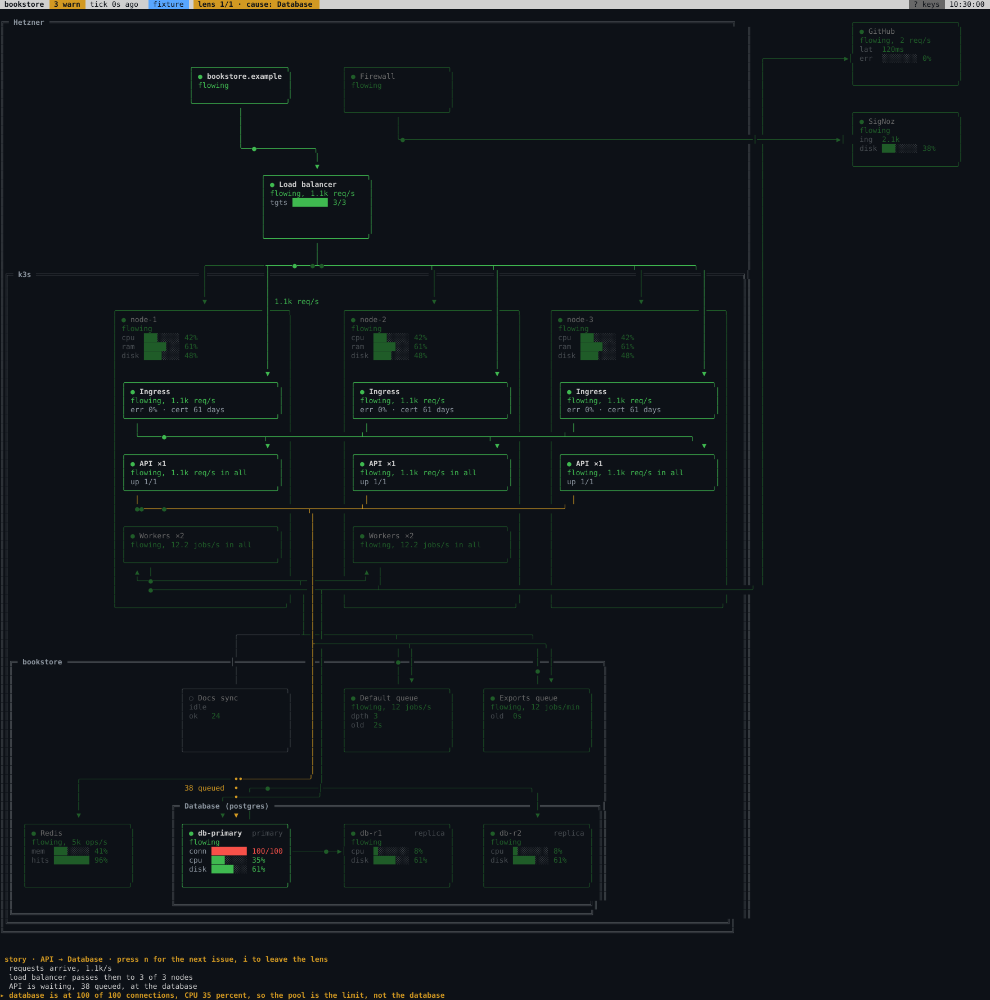

<div align="center">

# wassup

**One live architecture diagram of your Kubernetes system, in the terminal.**

Where is it stuck, since when, what changed.

[](https://github.com/danilopopovikj/wassup/actions/workflows/ci.yml)
[](https://pkg.go.dev/github.com/danilopopovikj/wassup)
[](https://scorecard.dev/viewer/?uri=github.com/danilopopovikj/wassup)
[](LICENSE)

[Demo](#demo) •
[Full setup with AI](#full-setup-with-ai) •
[Manual setup](#manual-setup)



</div>

wassup draws your system as one diagram in the terminal and keeps it live.
When something breaks, it lights up the path to the problem and tells you
what's going on in plain words.

It only reads. It can't change anything in your cluster or your databases,
and there's nothing to install in the cluster.

## Demo

No cluster needed. The demo replays a recorded incident:

```sh
go install github.com/danilopopovikj/wassup/cmd/wassup@latest
wassup demo
```

`wassup demo --list` shows all twelve. Press `i` to focus on the problem,
`enter` for details and `?` for every key.

## Full setup with AI

Open [Claude Code](https://claude.com/claude-code) (or any coding agent) in
the repo that deploys your system and paste this:

```text
Install wassup and set it up for this repository.

1. Install it, unless `wassup version` already works:
   curl -fsSL https://raw.githubusercontent.com/danilopopovikj/wassup/main/install.sh | sh
   (with Go 1.26 or newer, `go install github.com/danilopopovikj/wassup/cmd/wassup@latest`
   works too). If `wassup version` says its directory is not on my PATH,
   show me the line it prints. Ask me before installing anything system-wide.
2. Run `wassup init --print-prompt`. It prints the setup guide. Follow it
   step by step, and stop where it says to ask me.
```

It installs wassup, asks you which cluster to look at, drafts the diagram
from your repo and shows it to you before hooking up live data. When it's
done, run `wassup`.

## Manual setup

Install it:

```sh
curl -fsSL https://raw.githubusercontent.com/danilopopovikj/wassup/main/install.sh | sh
```

(or `go install github.com/danilopopovikj/wassup/cmd/wassup@latest` if you
have Go 1.26+). Then, in your repo:

```sh
wassup
```

The first run prints the setup guide. Every step is a command you can type
yourself, and [docs/setup.md](docs/setup.md) walks through it.

---

[Docs](docs/setup.md) • [Commands](docs/commands.md) • [Keys](docs/keys.md) •
[Contributing](CONTRIBUTING.md) • [MIT license](LICENSE)
